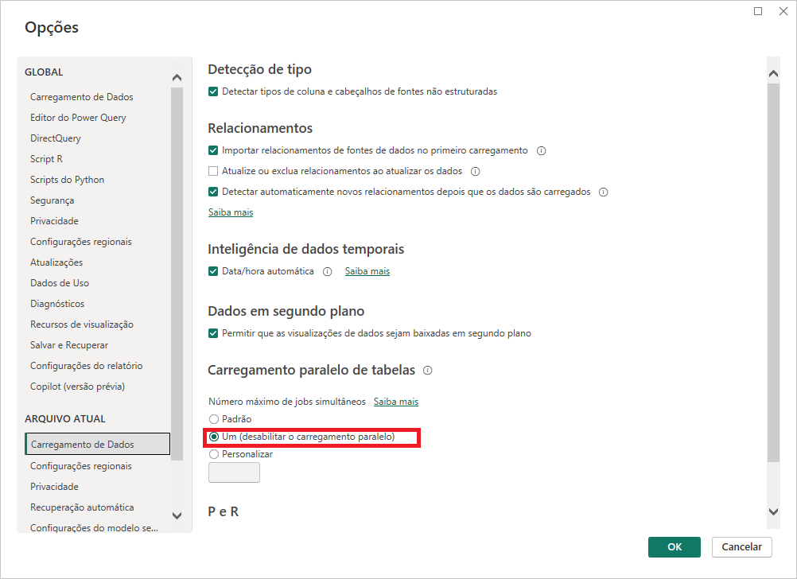
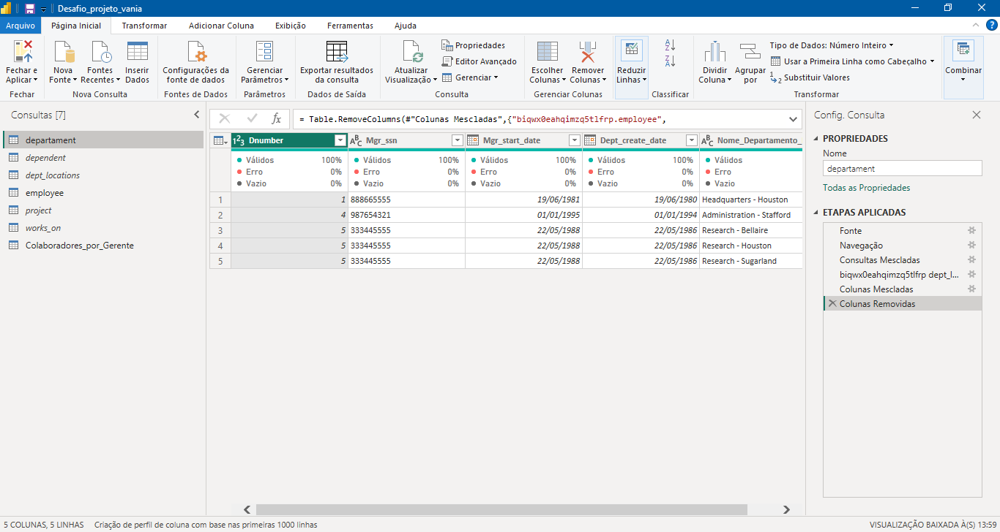
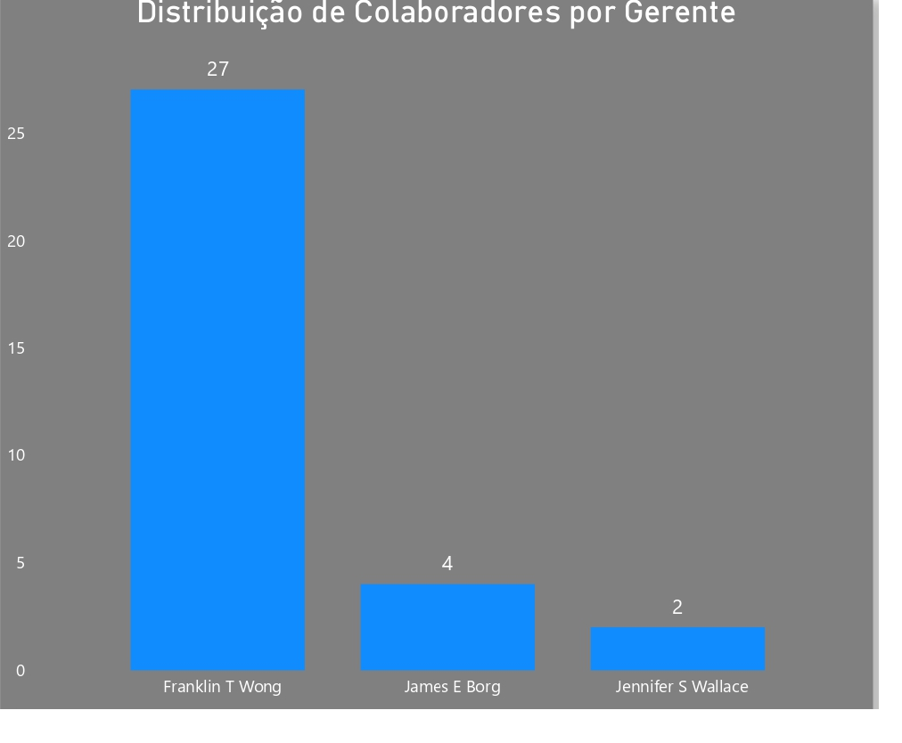

Desafio de Projeto: Processamento de Dados Simplificado com Power BI
📝 Descrição do Projeto
Este projeto consistiu na integração, extração e transformação de uma base de dados MySQL de um cenário de e-commerce e RH. O objetivo foi aplicar técnicas de limpeza e modelagem de dados para gerar insights sobre a estrutura organizacional da empresa, focando na relação entre colaboradores e gerentes.

🛠️ Tecnologias Utilizadas
Banco de Dados: MySQL (Hospedado no Clever Cloud)

Ferramenta de BI: Power BI Desktop

Linguagem de Consulta: SQL e Linguagem M (Power Query)

🚀 Adaptações de Infraestrutura
Diferente da proposta original que sugeria o uso do Azure, utilizei o Clever Cloud como provedor de banco de dados MySQL.

Motivação: Devido a limitações de acesso na conta de estudante (ausência de cartão de crédito para validação), o Clever Cloud foi a alternativa gratuita escolhida para garantir a execução do desafio.

Solução de Erros de Conexão: O servidor apresentava um limite de 5 conexões simultâneas (max_user_connections), o que causava falhas no carregamento inicial. Para solucionar, configurei o Power BI para desabilitar o carregamento paralelo de tabelas, forçando o sistema a carregar uma tabela por vez e garantindo a estabilidade da atualização.

Configuração de carregamento de dados ajustada para respeitar os limites do servidor.

⚙️ Etapas de Transformação de Dados
No Power Query, realizei as seguintes transformações para garantir a qualidade dos dados:

Cabeçalhos e Tipos: Ajuste manual de tipos de dados e promoção de cabeçalhos.

Tratamento de Nulos: Identificação de colaboradores sem gerente através da coluna Super_ssn.

Divisão de Colunas: Separação da coluna de endereço para facilitar análises geográficas futuras (Logradouro e Número).

Mesclagem de Consultas: * Junção de employee e departament para associar cada colaborador ao seu departamento.

Junção de departamentos e localizações para criar nomes únicos de locais.

Criação de Colunas: Uso da função de mesclagem para criar a coluna Nome_Completo combinando prenome e sobrenome.

Agrupamento e Otimização: * Criação da tabela Colaboradores_por_Gerente para contagem quantitativa de liderados.

Otimização de Performance: Desabilitei a carga (Load) das tabelas auxiliares para o modelo de dados, mantendo-as apenas como consultas no Power Query (indicado pelos nomes em itálico na lista de consultas).

Consultas otimizadas com carga desabilitada para melhorar o desempenho do modelo.

💡 Justificativa Técnica: Mesclar vs. Atribuir
Conforme solicitado na Diretriz 14, utilizei a operação de Mesclar (Merge). A escolha justifica-se pela necessidade de realizar um Join horizontal para enriquecer a tabela de funcionários com informações de outras tabelas (como nomes de departamentos) através de chaves estrangeiras. A operação de Atribuir (Append) não seria adequada, pois ela serve para empilhar registros verticalmente em tabelas de mesma estrutura, o que não era o caso desta modelagem.

📊 Visualização Final
O relatório final apresenta a distribuição de colaboradores sob a responsabilidade de cada gerente, permitindo uma análise rápida da estrutura de liderança da organização.

